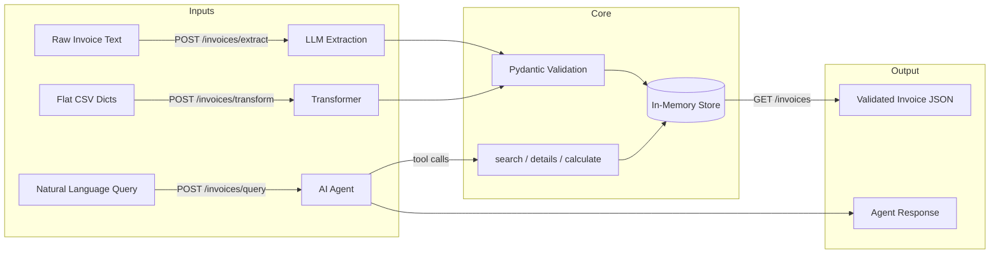

# BA Assessment — Faidon

An end-to-end invoice processing system built with Python, FastAPI, and the Anthropic SDK.

## Architecture



## Implementation Roadmap

- [x] **Phase 1** — Pydantic v2 schemas (`models.py`)
- [x] **Phase 2** — Data transformation: flat CSV dicts → nested JSON (`section-3/transform.py`)
- [x] **Phase 3** — LLM extraction: raw text → validated JSON (`section-1/extract.py`)
- [x] **Tests** — Unit tests for models, transform, and extraction pipeline (`tests/`)
- [ ] **Phase 4** — AI agent with native tool use (`section-2/agent.py`)
- [ ] **Phase 5** — FastAPI endpoints, Dockerfile, pytest suite (`section-5/`)
- [ ] **Written** — Conceptual questions (`section-1/answers.md`)
- [ ] **Written** — System design answers (`section-4/design.md`)

## Project Structure

```
models.py             # Pydantic v2 schemas (shared across sections)
/section-1/
  extract.py          # 1A — LLM-based structured data extraction
  answers.md          # 1B — Conceptual questions
/section-2/
  agent.py            # AI agent with native tool use
/section-3/
  transform.py        # API data transformation (flat → nested)
/section-4/
  design.md           # System design answers
/section-5/
  app.py              # FastAPI application
  Dockerfile
/samples/
  invoice_de.txt      # Sample German invoice
  invoice_en.txt      # Sample English invoice
/tests/
  __init__.py         # Makes tests/ a Python package (required by pytest)
  test_models.py      # Pydantic model validation tests
  test_transform.py   # Data transformation tests
  test_extract.py     # LLM extraction pipeline tests (mocked + real API)
requirements.txt
README.md
```

## Tech Stack

- **Python 3.11+**
- **Pydantic v2** — data modeling and validation
- **Anthropic SDK** — direct LLM integration (no LangChain / LlamaIndex)
- **OpenAI SDK** — secondary LLM provider (GPT-4o-mini)
- **Gemini REST API** — free-tier provider for testing (gemini-2.5-flash-lite)
- **FastAPI** — web API (Section 5)
- **Pytest** — testing

## LLM Providers

| Provider | Model | Use Case |
|----------|-------|----------|
| **Anthropic** | claude-sonnet-4 | Primary — best structured extraction |
| **OpenAI** | gpt-4o-mini | Secondary — cost-effective alternative |
| **Gemini** | gemini-2.5-flash-lite | Testing — free tier, used in CI/test suite |

## Setup

```bash
python -m venv venv
source venv/bin/activate
pip install -r requirements.txt
```

Create a `.env` file at the project root with your API keys:

```env
ANTHROPIC_API_KEY=your-key-here
OPENAI_API_KEY=your-key-here
GEMINI_API_KEY=your-key-here
```

Only the provider you intend to use needs a key. Gemini keys are free at [aistudio.google.com](https://aistudio.google.com).

## Usage

### Section 1 — Invoice Extraction

```bash
# Default: uses built-in sample invoice with Anthropic
python section-1/extract.py

# Switch provider with --provider / -p flag
python section-1/extract.py -p openai
python section-1/extract.py -p gemini

# Extract from a text file
python section-1/extract.py samples/invoice_de.txt
python section-1/extract.py samples/invoice_en.txt -p gemini

# Pipe from stdin
cat samples/invoice_de.txt | python section-1/extract.py
```

### Section 3 — Data Transformation

```bash
# Run with built-in sample data
python section-3/transform.py
```

### Running Tests

```bash
# Run all tests (mocked tests always run, real API tests need keys)
python -m pytest tests/ -v

# Run only mocked tests (no API keys needed)
python -m pytest tests/ -v -k "not Gemini"

# Run only real API tests
python -m pytest tests/test_extract.py -v -k "Gemini"
```

**Note on test structure:** The `tests/__init__.py` file is required so that pytest can discover and import test modules correctly. The section directories use hyphens (`section-1/`, `section-3/`) as required by the assessment spec, but hyphens are invalid in Python imports. The test files handle this via `importlib` to load modules from hyphenated paths.

## Assumptions

- All monetary values use EUR.
- VAT IDs follow the format: 2-letter country code + digits (e.g. `DE123456789`).
- Dates are normalized to ISO 8601 (`YYYY-MM-DD`).
- IBAN validation is format-based (country code + check digits + account), not checksum-verified.
- The extraction prompt is language-agnostic — it handles German, English, and other invoice formats.

## What I'd Improve Given More Time

- Full IBAN checksum validation (mod-97).
- PDF / scanned image ingestion with OCR.
- Persistent database storage instead of in-memory store.
- Rate limiting and authentication on the API.
- CI/CD pipeline with automated test runs.