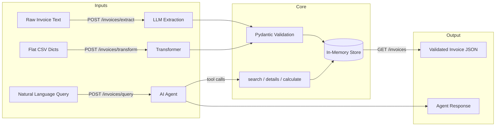

# BA Assessment — Faidon

An end-to-end invoice processing system built with Python and TypeScript. Both implementations share the same architecture: LLM-powered extraction, data transformation, AI agent with native tool use, and a web API.

- **Python** — FastAPI + Pydantic v2 (port 8000)
- **TypeScript** — Express + Zod (port 3000) — see [typescript/README.md](typescript/README.md)

## Architecture



## Implementation Roadmap

- [x] **Phase 1** — Pydantic v2 schemas (`models.py`)
- [x] **Phase 2** — Data transformation: flat CSV dicts → nested JSON (`section-3/transform.py`)
- [x] **Phase 3** — LLM extraction: raw text → validated JSON (`section-1/extract.py`)
- [x] **Phase 4** — AI agent with native tool-use loop + conversation memory (`section-2/agent.py`)
- [x] **Phase 5** — FastAPI API + Dockerfile + 18 pytest tests (`section-5/`)
- [x] **Tests** — 80+ tests across models, transform, extraction, agent, and API (`tests/`)
- [x] **Written** — Conceptual questions (`section-1/answers.md`)
- [x] **Written** — System design answers (`section-4/design.md`)
- [x] **Bonus** — Full TypeScript implementation with Express, Zod, and vitest (`typescript/`)

## Project Structure

```
models.py             # Pydantic v2 schemas (shared across sections)
/section-1/
  extract.py          # 1A — LLM-based structured data extraction
  answers.md          # 1B — Conceptual questions
/section-2/
  agent.py            # AI agent with native tool use
/section-3/
  transform.py        # API data transformation (flat → nested)
/section-4/
  design.md           # System design answers
/section-5/
  app.py              # FastAPI application
  Dockerfile
/samples/
  invoice_de.txt      # Sample German invoice
  invoice_en.txt      # Sample English invoice
/tests/
  __init__.py         # Makes tests/ a Python package (required by pytest)
  test_models.py      # Pydantic model validation tests
  test_transform.py   # Data transformation tests
  test_extract.py     # LLM extraction pipeline tests (mocked + real API)
  test_agent.py       # Agent tool functions + dispatch + API tests
  test_api.py         # FastAPI endpoint tests (mocked LLM, transform, query)
/typescript/              # Bonus: full TypeScript implementation
  src/
    models.ts            # Zod schemas (Pydantic equivalent)
    transform.ts         # Data transformation
    extract.ts           # LLM extraction
    agent.ts             # AI agent with tool use
    data.ts              # Shared mock invoice data
    app.ts               # Express API
    __tests__/           # Vitest test suite
  Dockerfile
  package.json
.dockerignore
requirements.txt
README.md
```

## Tech Stack

- **Python 3.11+**
- **Pydantic v2** — data modeling and validation
- **Anthropic SDK** — direct LLM integration (no LangChain / LlamaIndex)
- **OpenAI SDK** — secondary LLM provider (GPT-4o-mini)
- **Gemini REST API** — free-tier provider for testing (gemini-2.5-flash-lite)
- **FastAPI** — web API (Section 5)
- **Pytest** — testing

## LLM Providers

| Provider | Model | Use Case |
|----------|-------|----------|
| **Anthropic** | claude-sonnet-4 | Primary — best structured extraction |
| **OpenAI** | gpt-4o-mini | Secondary — cost-effective alternative |
| **Gemini** | gemini-2.5-flash-lite | Testing — free tier, used in CI/test suite |

## Setup

```bash
python -m venv venv
source venv/bin/activate
pip install -r requirements.txt
```

Create a `.env` file at the project root with your API keys:

```env
ANTHROPIC_API_KEY=your-key-here
OPENAI_API_KEY=your-key-here
GEMINI_API_KEY=your-key-here
```

Only the provider you intend to use needs a key. Gemini keys are free at [aistudio.google.com](https://aistudio.google.com).

## Usage

### Section 1 — Invoice Extraction

```bash
# Default: uses built-in sample invoice with Anthropic
python section-1/extract.py

# Switch provider with --provider / -p flag
python section-1/extract.py -p openai
python section-1/extract.py -p gemini

# Extract from a text file
python section-1/extract.py samples/invoice_de.txt
python section-1/extract.py samples/invoice_en.txt -p gemini

# Pipe from stdin
cat samples/invoice_de.txt | python section-1/extract.py
```

### Section 2 — AI Agent (Interactive CLI)

```bash
# Start the interactive agent (default: Anthropic)
python section-2/agent.py

# Switch provider
python section-2/agent.py -p openai
python section-2/agent.py -p gemini
```

The agent supports multi-step reasoning and remembers context across turns. Example queries:

- "What's the total amount owed by Digital Services AG across all their invoices?"
- "Which invoices are overdue?"
- "Show me the details of INV-003 and tell me what percentage of the total is from training"

Type `exit`, `quit`, or `bye` to end the session.

### Section 3 — Data Transformation

```bash
# Run with built-in sample data
python section-3/transform.py
```

### Section 5 — FastAPI

```bash
# Run the API server
python section-5/app.py

# Or with auto-reload for development
uvicorn section-5.app:app --reload
```

API is available at `http://localhost:8000`. Interactive docs at `http://localhost:8000/docs`.

**Endpoints:**

| Method | Path | Description |
|--------|------|-------------|
| `POST` | `/invoices/extract` | Extract structured data from raw invoice text via LLM |
| `POST` | `/invoices/transform` | Transform flat CSV-style records to nested JSON |
| `POST` | `/invoices/query` | Ask natural language questions about invoices |
| `GET` | `/invoices` | List all stored invoices (mock + extracted/transformed) |
| `GET` | `/health` | Health check |

**Example requests:**

```bash
# Transform flat records
curl -X POST http://localhost:8000/invoices/transform \
  -H "Content-Type: application/json" \
  -d '{"records": [{"invoice_number": "2024-0892", "invoice_date": "15.03.2024", "seller_name": "TechSolutions GmbH", "seller_street": "Musterstrasse 42", "seller_city": "Berlin", "seller_zip": "10115", "seller_country": "DE", "seller_vat_id": "DE123456789", "buyer_name": "Digital Services AG", "buyer_city": "Munchen", "buyer_vat_id": "DE987654321", "item_description": "Cloud Hosting", "item_quantity": "3", "item_unit_price": "450.00", "item_vat_rate": "19", "payment_days": "30", "iban": "DE89370400440532013000"}]}'

# Query invoices via AI agent
curl -X POST http://localhost:8000/invoices/query \
  -H "Content-Type: application/json" \
  -d '{"question": "Which invoices are overdue?", "provider": "gemini"}'

# List all invoices
curl http://localhost:8000/invoices
```

### Docker

```bash
# Python API (port 8000)
docker build -f section-5/Dockerfile -t invoice-api .
docker run -p 8000:8000 --env-file .env invoice-api

# TypeScript API (port 3000)
docker build -f typescript/Dockerfile -t invoice-api-ts .
docker run -p 3000:3000 --env-file .env invoice-api-ts
```

### Running Tests

```bash
# Run all tests (mocked tests always run, real API tests need keys)
python -m pytest tests/ -v

# Run only mocked tests (no API keys needed)
python -m pytest tests/ -v -k "not Gemini"

# Run only real API tests
python -m pytest tests/test_extract.py -v -k "Gemini"
```

**Note on test structure:** The `tests/__init__.py` file is required so that pytest can discover and import test modules correctly. The section directories use hyphens (`section-1/`, `section-3/`) as required by the assessment spec, but hyphens are invalid in Python imports. The test files handle this via `importlib` to load modules from hyphenated paths.

## Assumptions

- All monetary values use EUR.
- VAT IDs follow the format: 2-letter country code + digits (e.g. `DE123456789`).
- Dates are normalized to ISO 8601 (`YYYY-MM-DD`).
- IBAN validation is format-based (country code + check digits + account), not checksum-verified.
- The extraction prompt is language-agnostic — it handles German, English, and other invoice formats.

## What I'd Improve Given More Time

- Full IBAN checksum validation (mod-97).
- PDF / scanned image ingestion with OCR.
- Persistent database storage instead of in-memory store.
- Rate limiting and authentication on the API.
- CI/CD pipeline with automated test runs.